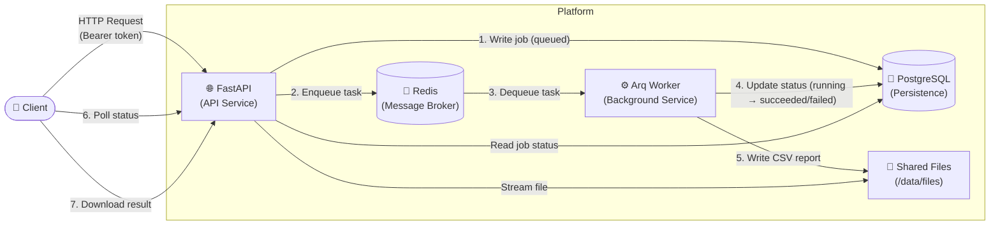
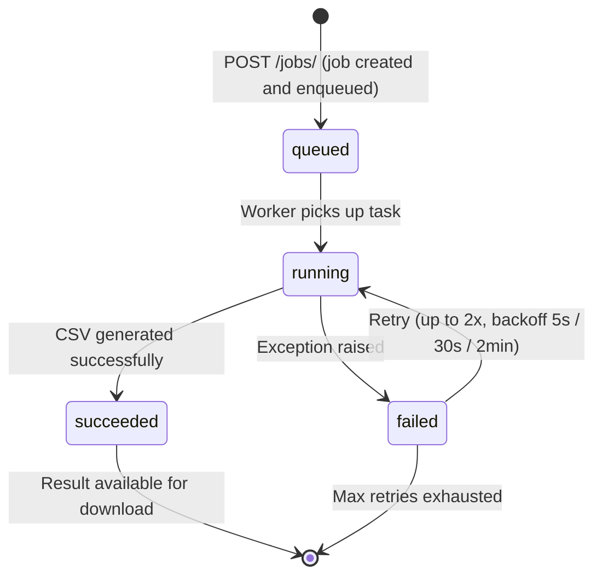
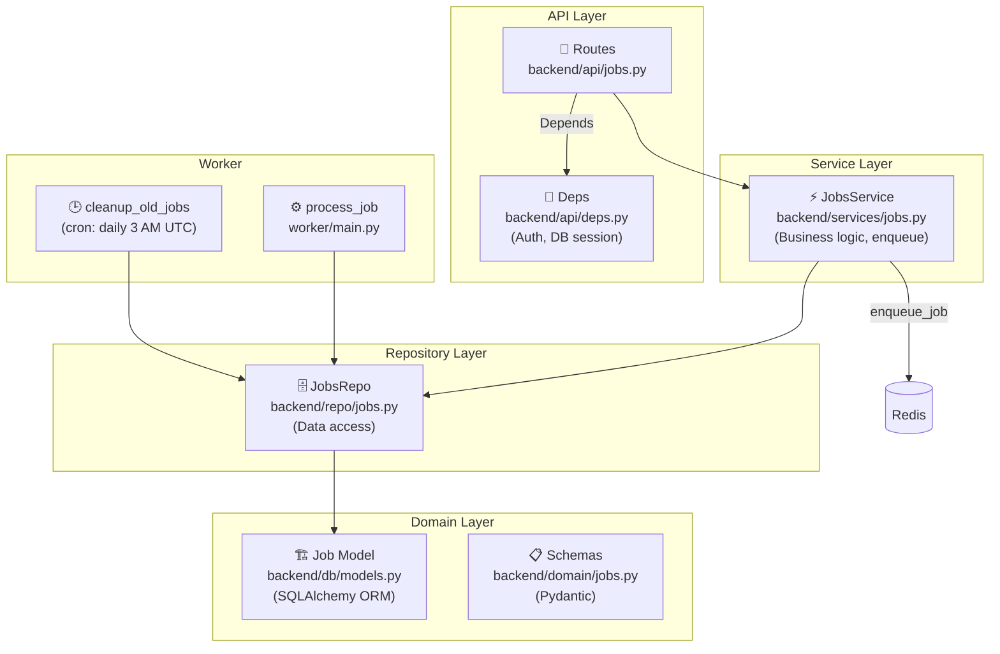
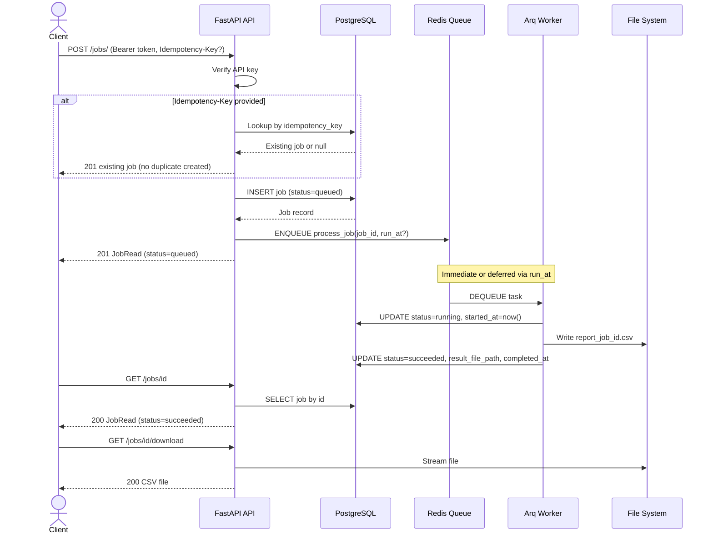

# Async Job Platform

A professional, production-ready asynchronous job processing system built with **Python**, **FastAPI**, **Arq**, and **PostgreSQL**.

This project was created as a training exercise to understand modern backend architectures, asynchronous programming, and background task management in Python.

## Purpose

The **Async Job Platform** handles long-running operations without blocking the user experience. Instead of making a user wait for a heavy task (like generating a CSV report), the API accepts the request, acknowledges it immediately, and processes it in the background.

### Key Features
- **Async API**: Built with FastAPI for high performance.
- **Background Workers**: Uses Arq (Redis-based) for reliable task queueing.
- **Persistence**: PostgreSQL stores job statuses, metadata, and results.
- **Idempotency**: Prevents duplicate job execution using custom headers.
- **Scheduled Jobs**: Supports deferred execution via `run_at`.
- **Clean Architecture**: Organized into layers (API, Service, Repository).
- **Automated Cleanup**: Daily cron job purges jobs and files older than 30 days.

---

## Architecture

### System Overview



---

### Job Lifecycle (State Machine)



---

### Layered Architecture



---

### Request Flow — POST /jobs/



---

## Directory Structure

```text
py-job-platform/
├── backend/                  # API Service (The Producer)
│   ├── api/
│   │   ├── deps.py           # Auth dependency (Bearer token)
│   │   └── jobs.py           # Route handlers
│   ├── db/
│   │   ├── models.py         # SQLAlchemy Job model & JobStatus enum
│   │   └── session.py        # Async engine & session factory
│   ├── domain/
│   │   └── jobs.py           # Pydantic schemas (JobCreate, JobRead)
│   ├── repo/
│   │   └── jobs.py           # Data Access Layer (Repository pattern)
│   ├── services/
│   │   └── jobs.py           # Business logic & task enqueuing
│   ├── core_config.py        # Settings (env vars via Pydantic)
│   ├── logger.py             # Structured JSON logging (structlog)
│   └── main.py               # FastAPI app entry point
├── worker/
│   └── main.py               # Task definitions, retry config, cron jobs
├── alembic/                  # Database migration scripts
├── docker-compose.yml        # Infrastructure (Postgres, Redis, API, Worker)
├── Dockerfile
└── requirements.txt
```

---

## API Reference

| Method | Path | Description | Auth |
|--------|------|-------------|------|
| `POST` | `/jobs/` | Create a new job | ✅ |
| `GET` | `/jobs/` | List jobs (filterable, paginated) | ✅ |
| `GET` | `/jobs/{id}` | Get a single job by ID | ✅ |
| `GET` | `/jobs/{id}/download` | Download the result CSV (when succeeded) | ✅ |
| `GET` | `/health` | Health check | ✅ |

### Query Parameters — `GET /jobs/`

| Param | Type | Description |
|-------|------|-------------|
| `status` | `queued\|running\|succeeded\|failed` | Filter by status |
| `created_after` | `datetime` | Jobs created after timestamp |
| `created_before` | `datetime` | Jobs created before timestamp |
| `limit` | `int` | Max results (default: 100) |
| `offset` | `int` | Pagination offset (default: 0) |

### Headers

| Header | Required | Description |
|--------|----------|-------------|
| `Authorization` | ✅ | `Bearer supersecretkey` |
| `Idempotency-Key` | ❌ | Unique string to prevent duplicate job creation |

---

## Getting Started

### Prerequisites
- Docker and Docker Compose

### Running the Platform

```bash
# Clone the repository
git clone https://github.com/your-username/py-job-platform.git
cd py-job-platform

# Start all services
docker-compose up --build
```

Open `http://localhost:8000/docs` for the interactive Swagger UI.

**To authenticate in Swagger:** click the **"Authorize"** button and enter `supersecretkey`.

---

## Tech Stack

| Layer | Technology |
|-------|-----------|
| Framework | [FastAPI](https://fastapi.tiangolo.com/) |
| Task Queue | [Arq](https://github.com/samuelcolvin/arq) (Redis-based) |
| Database | [PostgreSQL 15](https://www.postgresql.org/) |
| ORM | [SQLAlchemy 2.0](https://www.sqlalchemy.org/) (Async) |
| Migrations | [Alembic](https://alembic.sqlalchemy.org/) |
| Validation | [Pydantic v2](https://docs.pydantic.dev/) |
| Logging | [structlog](https://www.structlog.org/) (JSON output) |
| Containerization | [Docker](https://www.docker.com/) + Docker Compose |
| Async DB Driver | asyncpg |
| CI | GitHub Actions (ruff linting) |

---

## Worker Behaviour

### Retry Strategy

| Attempt | Delay |
|---------|-------|
| 1st retry | 5 seconds |
| 2nd retry | 30 seconds |
| Final failure | `status=failed`, `error_message` stored |

### Cron Jobs

| Task | Schedule | Action |
|------|----------|--------|
| `cleanup_old_jobs` | Daily at 3 AM UTC | Deletes jobs and CSV files older than 30 days |

---

## Testing

See [TESTING.md](./TESTING.md) for detailed instructions covering Swagger UI, PowerShell end-to-end tests, and worker log monitoring.

---

## Key Learning Points

- **Asynchronous Programming**: Extensive use of `async`/`await` across the stack.
- **Dependency Injection**: Using FastAPI's `Depends` for database sessions and security.
- **Repository Pattern**: Separating database logic from business logic.
- **Producer-Consumer**: Decoupling request handling from task execution via Redis.
- **Container Orchestration**: Coordinating multiple services with Docker Compose.
- **Error Handling**: Robust retry mechanisms and status tracking for background tasks.
- **Idempotency**: Safe retries without duplicate side effects.
